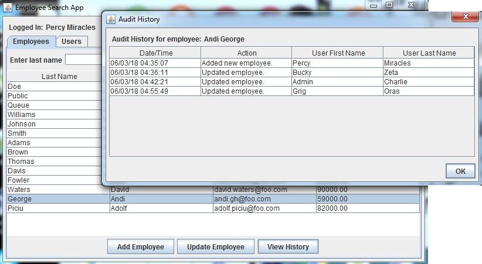
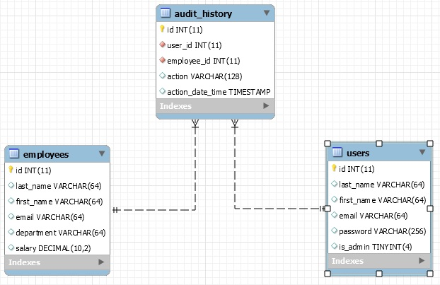
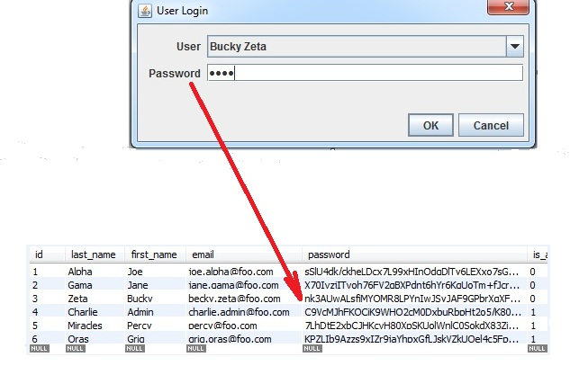
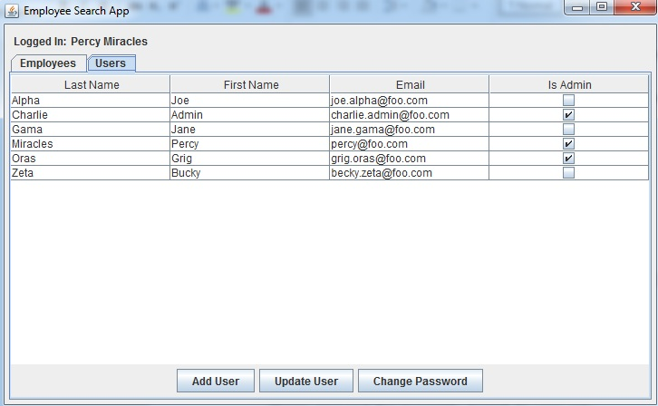
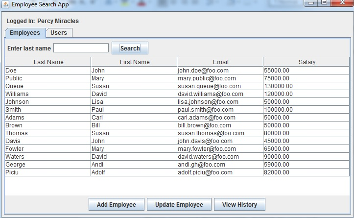
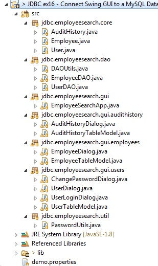

# JDBCSwing
This application is written in Java and the GUI is made in Swing.

The program allows a user to add and update employees. Each action on the employee is tracked in the audit_history table. 

This demonstrates the linking of database tables. In this case, the audit_history table is linked to the employees table 
and users table.

The program performs checks a user's password against an encrypted password in the database.

The MySQL DB script will create all 3 tables. It will also create 5 users accounts.

At the login screen, select any user from the drop-down list. The password for each account is: “java”. The password 
is case-sensitive.

Click the User's tab. There are two types of accounts: admins and non-admins. If you are an admin, you can perform all user functions:
   - Add user
   - Update all users in the app
   - Change password for all users in the app

If you aren’t admin, you can only update your account:
   - Update currently logged in user only
   - Change password for currently logged in user only
   
   

Also you can click the employee tab and you can perform the following functions:
  - Add employee
  - Update employee
  - Search employee
  - View audit history
  
  
  
  This is the structure of the app:
  

